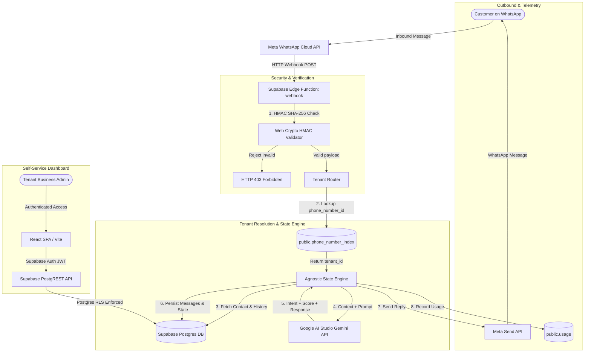

# Architecture Blueprint (`docs/ARCHITECTURE.md`)

## 1. System Overview

**WhatsApp Sales Hub** is built as an enterprise-grade, serverless multi-tenant platform with **zero upfront infrastructure costs**. A single managed Postgres instance with Row Level Security (RLS) handles multiple independent businesses (tenants), providing complete data segregation, dynamic AI persona execution, deterministic workflow tracking, and usage metering.



---

## 2. Relational Multi-Tenant Data Model (Postgres + RLS)

Every tenant's operational data is strictly isolated within Postgres using Row Level Security.

### 2.1. `public.tenants`
```sql
create table public.tenants (
  id uuid primary key default gen_random_uuid(),
  name text not null,
  plan_tier text not null default 'trial' check (plan_tier in ('trial', 'starter', 'growth', 'scale')),
  status text not null default 'onboarding' check (status in ('onboarding', 'active', 'suspended', 'cancelled')),
  created_at timestamptz not null default now(),
  updated_at timestamptz not null default now()
);
```

### 2.2. `public.tenant_users`
Links Supabase authenticated users (`auth.users`) to specific tenants:
```sql
create table public.tenant_users (
  id uuid primary key default gen_random_uuid(),
  tenant_id uuid not null references public.tenants(id) on delete cascade,
  user_id uuid not null references auth.users(id) on delete cascade,
  role text not null default 'agent' check (role in ('admin', 'agent')),
  created_at timestamptz not null default now(),
  unique (tenant_id, user_id)
);
```

### 2.3. `public.phone_number_index` (Server-Only Routing)
Restricted table with no client RLS policy (accessible only by `service_role`):
```sql
create table public.phone_number_index (
  phone_number_id text primary key,
  tenant_id uuid not null references public.tenants(id) on delete cascade,
  waba_id text,
  created_at timestamptz not null default now()
);
```

### 2.4. `public.contacts`
Stores lead information with real-time scoring (`frio`, `morno`, `quente`):
```sql
create table public.contacts (
  id uuid primary key default gen_random_uuid(),
  tenant_id uuid not null references public.tenants(id) on delete cascade,
  wa_phone text not null,
  name text,
  lead_score text not null default 'frio' check (lead_score in ('frio', 'morno', 'quente')),
  stage text not null default 'novo',
  created_at timestamptz not null default now(),
  updated_at timestamptz not null default now(),
  unique (tenant_id, wa_phone)
);
```

### 2.5. `public.conversations`
Inbound and outbound message history:
```sql
create table public.conversations (
  id uuid primary key default gen_random_uuid(),
  tenant_id uuid not null references public.tenants(id) on delete cascade,
  contact_id uuid not null references public.contacts(id) on delete cascade,
  direction text not null check (direction in ('inbound', 'outbound')),
  message_body text,
  message_type text not null default 'text',
  created_at timestamptz not null default now()
);
```

### 2.6. `public.usage` (Server-Only Telemetry)
Monthly telemetry counters per tenant:
```sql
create table public.usage (
  id uuid primary key default gen_random_uuid(),
  tenant_id uuid not null references public.tenants(id) on delete cascade,
  period text not null,
  meta_messages_free_window int not null default 0,
  meta_messages_paid int not null default 0,
  gemini_tokens_used bigint not null default 0,
  created_at timestamptz not null default now(),
  updated_at timestamptz not null default now(),
  unique (tenant_id, period)
);
```

---

## 3. Webhook Lifecycle & Execution Flow

1. **Meta Webhook Ingestion**:
   - Meta sends an HTTP POST with `X-Hub-Signature-256`.
   - `webhook` Edge Function extracts raw body buffer and validates HMAC against `META_APP_SECRET` using Web Crypto API. Invalid requests return HTTP 403.
2. **Challenge Verification**:
   - For webhook setup, `GET` requests with `hub.mode=subscribe` and `hub.verify_token` are validated against `META_WEBHOOK_VERIFY_TOKEN`.
3. **Tenant Resolution**:
   - Inbound message payload provides `entry[0].changes[0].value.metadata.phone_number_id`.
   - Function looks up `public.phone_number_index` with `service_role` to retrieve `tenant_id`.
4. **State Machine & Gemini Processing**:
   - Loads contact and conversation history.
   - Evaluates escalation keywords; if matched, escalates immediately to `transbordo_humano`.
   - Invokes Google AI Studio Gemini API (`gemini-2.5-flash`) with prompt boundary and `maxOutputTokens: 500`.
   - Receives lead score (`frio`, `morno`, `quente`), extracted sales data, and reply text.
5. **Dispatch & Metering**:
   - Outbound reply is dispatched to Meta Graph API `https://graph.facebook.com/v21.0/{phone_number_id}/messages`.
   - Message and usage counters are atomically written to `public.conversations` and `public.usage`.

