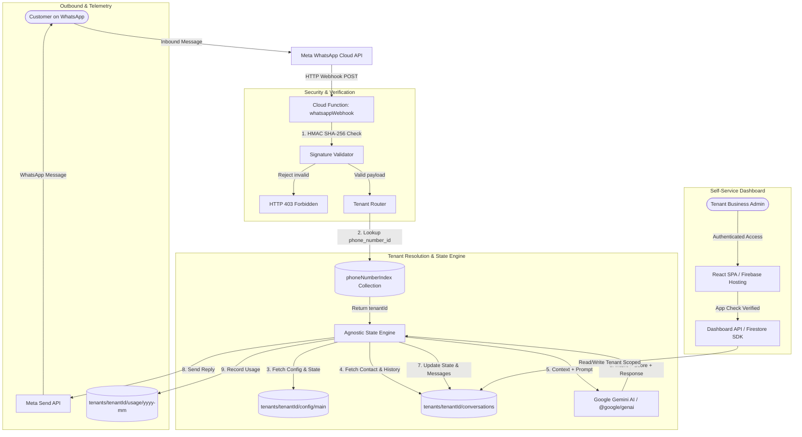

# Architecture Blueprint (`docs/ARCHITECTURE.md`)

## 1. System Overview

**WhatsApp Sales Hub** is built as an enterprise-grade, serverless multi-tenant platform. A single, shared infrastructure handles multiple independent businesses (tenants), providing complete data segregation, dynamic AI persona execution, deterministic workflow tracking, and usage metering.



---

## 2. Multi-Tenant Data Model

Every tenant's operational data is strictly isolated within the root hierarchy `tenants/{tenantId}/**`.

### 2.1. Tenant Root
- **Path**: `tenants/{tenantId}`
- **Schema**:
  ```typescript
  interface TenantRecord {
    id: string;
    companyName: string;
    documentNumber: string; // CNPJ / CPF
    plan: "starter" | "pro" | "enterprise";
    status: "active" | "trialing" | "past_due" | "suspended";
    phoneNumberId: string;
    displayPhoneNumber: string;
    wabaId: string; // WhatsApp Business Account ID
    createdAt: FirebaseFirestore.Timestamp;
    updatedAt: FirebaseFirestore.Timestamp;
  }
  ```

### 2.2. Tenant Configuration (Agnostic Bot Engine)
- **Path**: `tenants/{tenantId}/config/main`
- **Schema**:
  ```typescript
  interface BotConfig {
    persona: {
      botName: string;
      tone: "friendly" | "professional" | "enthusiastic" | "consultative";
      companyDescription: string;
      salesPitch: string;
      knowledgeBase: string[];
    };
    businessHours: {
      enabled: boolean;
      timezone: string; // e.g. "America/Sao_Paulo"
      start: string; // "09:00"
      end: string; // "18:00"
      outsideHoursMessage: string;
    };
    escalation: {
      humanTakeoverKeywords: string[];
      notifyEmails: string[];
      escalationMessage: string;
    };
    stateMachine: {
      initialState: string;
      states: Record<string, {
        name: string;
        description: string;
        systemPromptInstructions: string;
        nextPossibleStates: string[];
        terminal?: boolean;
      }>;
    };
  }
  ```

### 2.3. Contacts & Real-Time Lead Scoring
- **Path**: `tenants/{tenantId}/contacts/{contactId}` (where `contactId` is normalized E.164 phone number, e.g. `5511999998888`)
- **Schema**:
  ```typescript
  interface Contact {
    id: string; // phone number
    name: string;
    phoneNumber: string;
    funnelStage: "new_lead" | "hot_lead" | "customer" | "lost";
    leadScore: "frio" | "morno" | "quente";
    scoreReason: string;
    currentState: string;
    assignedAgent: "ai" | "human";
    tags: string[];
    extractedData: Record<string, any>;
    lastActiveAt: FirebaseFirestore.Timestamp;
    createdAt: FirebaseFirestore.Timestamp;
  }
  ```

### 2.4. Conversations & Message History
- **Path**: `tenants/{tenantId}/conversations/{conversationId}/messages/{messageId}`
- **Schema**:
  ```typescript
  interface ConversationMessage {
    id: string;
    conversationId: string;
    sender: "contact" | "bot" | "agent";
    text: string;
    timestamp: FirebaseFirestore.Timestamp;
    metaMessageId?: string;
    status: "sent" | "delivered" | "read" | "failed";
    tokensUsed?: {
      prompt: number;
      candidates: number;
    };
  }
  ```

### 2.5. Usage & Metering (Billing Telemetry)
- **Path**: `tenants/{tenantId}/usage/{yyyy-mm}`
- **Schema**:
  ```typescript
  interface TenantMonthlyUsage {
    period: string; // "2026-09"
    metaMessages: {
      freeCustomerCareWindow: number; // Inside 24h window (Free)
      billableTemplateMarketing: number;
      billableTemplateUtility: number;
    };
    geminiTokens: {
      promptTokens: number;
      candidateTokens: number;
      totalCostEstimatedUsd: number;
    };
    lastUpdatedAt: FirebaseFirestore.Timestamp;
  }
  ```

### 2.6. Global Phone Number Index (Protected)
- **Path**: `phoneNumberIndex/{phone_number_id}`
- **Schema**:
  ```typescript
  interface PhoneNumberRouting {
    tenantId: string;
    registeredAt: FirebaseFirestore.Timestamp;
  }
  ```

---

## 3. Webhook Lifecycle & Execution Flow

1. **Meta Webhook Ingestion**:
   - Meta sends an HTTP POST with `X-Hub-Signature-256`.
   - `whatsappWebhook` Cloud Function extracts raw body buffer and validates HMAC against `META_APP_SECRET`. Invalid requests return HTTP 403.
2. **Challenge Verification**:
   - For webhook setup, `GET` requests with `hub.mode=subscribe` and `hub.verify_token` are validated against `META_WEBHOOK_VERIFY_TOKEN`.
3. **Tenant Resolution**:
   - Inbound message payload provides `entry[0].changes[0].value.metadata.phone_number_id`.
   - Function looks up `phoneNumberIndex/{phone_number_id}` to retrieve `tenantId`.
4. **State Machine & Gemini Processing**:
   - Loads tenant config and current contact document.
   - If contact `assignedAgent === "human"`, message is recorded to Firestore for the unified inbox without automated bot reply.
   - If `assignedAgent === "ai"`, payload + conversation context is passed to the State Engine.
   - Gemini calculates lead scoring, verifies state transition criteria, and produces response text.
5. **Dispatch & Metering**:
   - Outbound reply is dispatched to Meta Graph API `https://graph.facebook.com/v21.0/{phone_number_id}/messages`.
   - Tokens and message status are atomically incremented in `tenants/{tenantId}/usage/{yyyy-mm}`.
